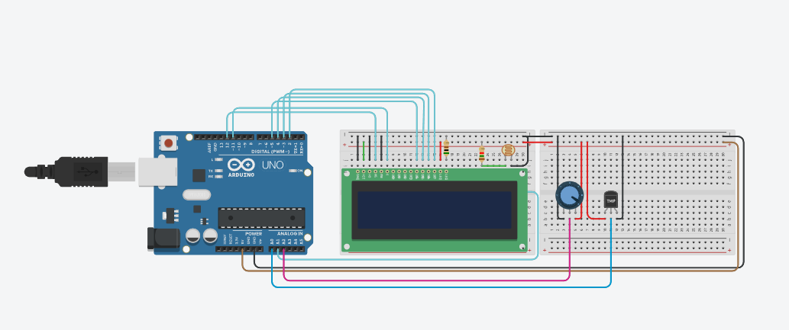

# Participantes
- Ana Zerlin            RM 98065
- Bianca Dancs          RM 551645
- Gabriel Pimentel      RM 99880
- Hellen Assis          RM 98284

# O que é

Este projeto foi criado para monitorar o ambiente em que os vinhos da Vinheria Agnello são armazenados. Fatores como luminosidade, umidade e temperatuda podem influenciar a qualidade do vinho; lugares com penumbra são favoráveis já que os raios ultravioletas causam alterações nos compostos orgânicos, a falta de umidade pode causar uma má vedação das garrafas e a temperatura ideal de 13° para não causar odores indesejados.

# Recursos necessários para a implementação

## Físico
- DHT11, para verificar a umidade e temperatura;
- LDR, capta e luminosidade;
- IoT, conecta com o ESP32 e recebe as informações dadas pelo medidor;

## Software
- MQTT
- STH-Comet

# Como funciona?

O DHT11 e o LDR recebem as informações e através do ESP32 mandam para os softwares, que armazem e mostram os dados em gráfico.

# Demonstração

## Imagem, sem o ESP32

## Vídeo, com o ESP32
https://www.youtube.com/watch?v=64VOE39yQIc